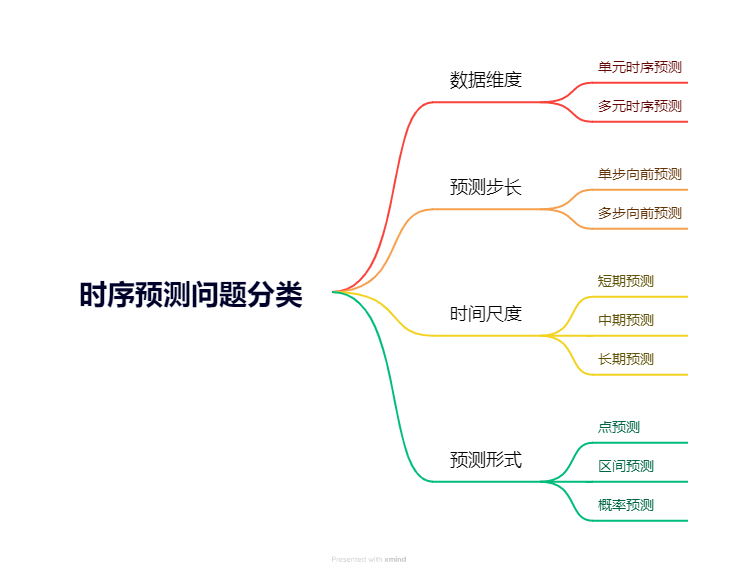

# 1.3 时序问题分类

本文目录：
[toc]

从不同的角度，时序预测问题可以分为好几类，不用类别的问题可以采用的方法各不相同。本节将从数据维度、预测步长、时间尺度、数据结构等方面给大家介绍不同类型的时序预测问题。




## 1. **按数据维度分类**
从数据维度对时间序列预测问题的分类，主要包括**单元时序预测**（Univariate Time Series Forecasting）和**多元时序预测**（Multivariate Time Series Forecasting）。每种类型适用于不同场景，使用不同的建模方法和求解策略。以下是详细介绍：

### 1.1 **单元时序预测（Univariate Time Series Forecasting）**

#### 定义：
单元时序预测是指在仅有一个变量的情况下，根据该变量的历史数据来预测其未来值。这个变量可能是时间序列中的一个关键指标，比如某商品的销售量、某个股票的股价等。

#### 特点：
- 只使用一个变量的历史数据，不依赖其他外部变量。
- 预测对象是该变量的未来值。
- 通常用于相对简单的时间序列预测任务。

#### 例子：
假设你想预测未来一周某地区的每日平均气温（以摄氏度为单位）。你有过去几个月的每日气温数据，这就是一个典型的单元时序预测问题。

```text
日期      气温（摄氏度）
2024-01-01  5
2024-01-02  7
2024-01-03  6
...
```

#### 求解方法：
单元时序预测的求解方法主要依赖该变量的历史模式和规律。常用方法包括：

1. **ARIMA（AutoRegressive Integrated Moving Average，自回归积分滑动平均模型）**：
   ARIMA 是经典的时序预测模型之一，适用于单元时序预测。它通过自回归和移动平均来捕捉时间序列中的模式，并通过差分操作处理非平稳数据。
   
   适用场景：适合处理有季节性或非季节性趋势的平稳序列。
   
   公式：\( ARIMA(p, d, q) \)
   - \( p \)：自回归项数
   - \( d \)：差分次数
   - \( q \)：移动平均项数
   
   **例子**：
   对气温数据进行单元时序预测时，可以用 ARIMA 模型来拟合序列并预测未来几天的气温。

2. **ETS（Exponential Smoothing，指数平滑法）**：
   ETS 模型是一类基于指数平滑的预测方法，主要用于捕捉时间序列中的趋势和季节性。它适合预测数据中存在较强趋势或周期性的单元时间序列。

   适用场景：适合有趋势和周期性的时间序列，如气温、销售数据。

3. **Prophet**：
   Prophet 是由 Facebook 开发的时序预测工具，专为捕捉趋势性、季节性和节假日效应而设计。它非常适合处理长时间跨度、带有噪声的单元时序数据。
   
   适用场景：适合长时间的趋势预测，能自动处理缺失值和节假日等异常点。

---

### 1.2 **多元时序预测（Multivariate Time Series Forecasting）**

#### 定义：
多元时序预测是指同时使用多个相关变量的时间序列数据来预测目标变量的未来值。这些变量可以是目标变量的历史值，也可以是外部变量（即“外生变量”）。相比单元时序，多元时序预测能捕捉变量之间的相互作用，更适合复杂的预测任务。

#### 特点：
- 使用多个变量的历史数据来预测目标变量的未来值。
- 适合处理变量之间存在相互影响的复杂系统。
- 可以处理更加复杂的预测任务，通常需要更多数据和更复杂的模型。

#### 例子：
假设你想预测未来一周某城市的空气质量（如 PM2.5 浓度）。除了过去的 PM2.5 数据，还可以使用其他相关变量（如温度、湿度、风速、交通流量等）作为辅助变量。

```text
日期      PM2.5（μg/m³）  温度（摄氏度）  湿度（%）  风速（km/h）  交通流量
2024-01-01  55            5           65     10         1000
2024-01-02  60            7           70     8          1200
2024-01-03  58            6           60     12         1100
...
```

#### 求解方法：
多元时序预测的模型需要同时捕捉多个变量之间的动态关系，因此它比单元时序模型更复杂。常用方法包括：

1. **VAR（Vector Autoregression，向量自回归模型）**：
   VAR 模型是一种多元时序建模方法，假设每个变量的值不仅取决于它自身的历史值，还取决于其他变量的历史值。通过这种方法，可以捕捉多个变量之间的相互依赖关系。
   
   适用场景：适合有多个相互影响的时间序列，如经济指标中的多个变量（GDP、消费、利率等）。

   **例子**：
   在预测 PM2.5 浓度时，温度、湿度和风速会对 PM2.5 浓度产生影响。VAR 模型可以同时建模这些变量，捕捉它们之间的相互作用，并预测未来的 PM2.5 浓度。

2. **LSTM（Long Short-Term Memory，长短期记忆神经网络）**：
   LSTM 是一种专门用于处理时间序列的递归神经网络（RNN），能够捕捉长时间依赖关系，特别适合处理序列较长、存在非线性关系的多元时序数据。相比传统统计模型，LSTM 能处理复杂的时间依赖性和不同变量之间的非线性关系。
   
   适用场景：适合处理长时间、多维度且非线性的时间序列，如电力负荷预测、交通流量预测等。

   **例子**：
   在空气质量预测中，使用 LSTM 模型同时考虑 PM2.5 浓度和其他相关变量（如温度、湿度等）的时间序列，预测未来空气质量变化。

3. **多元线性回归（Multivariate Linear Regression）**：
   如果多个变量之间的关系相对简单，可以使用多元线性回归方法来预测未来值。虽然这种方法假设变量之间的关系是线性的，但在某些场景下依然有效。

   适用场景：适合线性相关性较强的时序数据预测，如简单的经济指标或气象数据预测。

4. **XGBoost 和其他树模型**：
   现代机器学习模型如 XGBoost、随机森林等，也能用于多元时序预测，尤其是当数据中存在非线性关系时。虽然这些模型本质上不是时序模型，但通过适当的特征构造（如滞后特征、滚动窗口特征等），它们也能在多元时序预测中表现出色。

   适用场景：适合复杂非线性关系、多维度的预测任务，如金融市场分析、生产计划预测等。

---

### 1.3 **单元与多元时序预测的对比**
| 分类 | 单元时序预测 | 多元时序预测 |
| --- | --- | --- |
| **输入数据** | 只有一个时间序列 | 多个时间序列 |
| **复杂性** | 简单，建模容易 | 复杂，需要处理多个变量之间的关系 |
| **适用场景** | 变量间独立或无外生影响的情况 | 存在多个相互影响的变量 |
| **常用模型** | ARIMA、ETS、Prophet | VAR、LSTM、XGBoost、MLP |
| **模型特点** | 只考虑目标变量历史值 | 同时考虑多个变量的历史值和相互关系 |


---

## 2. **按预测步长分类**

从预测步长的角度，时间序列预测问题可以分为**单步向前预测**（One-Step Ahead Forecasting）和**多步向前预测**（Multi-Step Ahead Forecasting）。在时间序列中，**每一个数据点代表一个时间步（step）**。例如逐个小时预测气温，那么单步向前预测就是下一个钟的气温，2步向前预测就是预测接下来2个钟的气温，3步向前预测就是预测接下来3个钟的气温，依次类推。

### 2.1 **单步向前预测（One-Step Ahead Forecasting）**

#### 定义：
单步预测是指在给定历史数据的情况下，预测下一个时间点的值。这种方法仅考虑一步的预测目标。

#### 特点：
- 只预测未来最近的一个时间步（如下一个小时、下一天等）。
- 预测任务较为简单，模型仅需关注最短时间范围内的变化。
- 可以基于当前预测结果重新迭代地进行未来时刻的预测（滚动预测）。

#### 例子：
假设你想预测明天的股票价格，根据过去几天的价格数据，仅预测接下来的一个交易日的收盘价。

```text
日期      股票价格（元）
2024-01-01  100
2024-01-02  102
2024-01-03  105
...
```

#### 求解方法：
单步预测问题只需预测下一个时间点的值，故求解相对简单，传统的统计模型、机器学习、深度学习等方法都能完成单步预测。这些模型通过给定的输入数据预测下一个时刻的目标值。例如：

1. **ARIMA**：
   ARIMA 模型适用于单步预测，它根据过去的数据趋势来预测下一个时间点的值。在单步预测场景下，ARIMA 只需要预测一步，因此无需处理未来步长的问题。

   **例子**：使用 ARIMA 预测下一天的股票价格。

2. **LSTM**：
   LSTM 模型通过捕捉时间序列中的长短期依赖性，预测下一个时间点的值。对于单步预测，它会基于输入的序列，直接输出下一个时间点的预测值。

3. **简单线性回归**：
   如果预测变量和时间序列的线性关系较强，简单线性回归模型也可以用于单步预测。它根据历史趋势直接拟合出下一个时间步的值。

---

### 2.2 **多步向前预测（Multi-Step Ahead Forecasting）**

#### 定义：
多步预测是指在给定历史数据的情况下，预测多个未来时间点的值。预测的时间步数可以是固定的（如预测未来的 3 小时或 7 天）或变动的。

#### 特点：
- 需要预测多个未来时间步。
- 每一步预测的误差可能会累积，导致较长时间步的预测精度下降。
- 需要更复杂的建模策略来处理未来时间步之间的相互影响。

#### 例子：
假设你要预测未来一周的股票价格。根据过去几天的价格数据，预测接下来 7 天的价格变化。

```text
日期      股票价格（元）
2024-01-01  100
2024-01-02  102
2024-01-03  105
...
```

#### 求解方法：
多步向前预测需要同时预测多个未来的时间步，相对于单步预测更具挑战性，因为误差会随预测步长的增加而积累。因此，多步预测通常需要更复杂的策略。以下是常用的多步预测方法的详细介绍，包括直接法、递归法、联合法和序列到序列模型（seq2seq）等。

- **递归法（Recursive Method）**

    - **定义**：
递归法是一种将单步预测模型应用于多步预测的策略。模型首先预测下一步的值，然后将这个预测值作为输入，继续预测之后的步数。这一过程不断重复，直到达到所需的步长。

    - **特点**：
      - 简单易实现，利用单步预测模型即可。
      - 主要问题是误差会随着预测步数的增加而累积，因为后续步长的预测基于前一步的预测结果。

    - **举例**：
        假设你有每天的温度数据，想预测未来 3 天的温度。你可以使用递归法，通过以下步骤进行：
        1. 预测第 1 天的温度，将预测结果作为输入。
        2. 用第 1 天的预测结果预测第 2 天的温度。
        3. 用第 2 天的预测结果预测第 3 天的温度。

    ```python
    import numpy as np
    from sklearn.linear_model import LinearRegression

    # 示例数据：假设我们有过去5天的温度数据
    X_train = np.array([[30], [32], [34], [33], [31]])  # 历史温度
    y_train = np.array([32, 34, 33, 31, 30])  # 未来温度

    # 训练单步预测模型
    model = LinearRegression()
    model.fit(X_train, y_train)

    # 递归预测未来 3 天
    n_steps = 3
    last_day_temp = np.array([[31]])  # 假设最后一天的温度是 31
    forecast = []

    for _ in range(n_steps):
        next_temp = model.predict(last_day_temp)
        forecast.append(next_temp[0])
        last_day_temp = np.array([[next_temp]])  # 使用预测值作为下一步的输入

    print(forecast)
    ```

    - **优点**：
      - 实现简单，适用于单步预测模型。
    
    - **缺点**：
      - 随着预测步长的增加，误差会逐渐累积，导致长时间步的预测效果较差。

---

- **直接法（Direct Method）**

    - **定义**：
    直接法为每个预测的时间步独立训练一个模型。每个模型只预测特定的未来时间步，因此每个预测步的模型是独立的，没有累积误差的问题。

    - **特点**：
    - 避免了误差累积问题，因为每个未来的时间点都单独预测。
    - 需要训练多个模型，计算和实现的复杂度较高。

    - **举例**：
    假设你有每天的温度数据，想预测未来 3 天的温度。你可以为第 1 天、第 2 天和第 3 天各训练一个模型。

    ```python
    # 假设我们有过去5天的温度数据
    X_train = np.array([[30], [32], [34], [33], [31]])  # 历史温度
    y_train_day_1 = np.array([32, 34, 33, 31, 30])  # 第一天预测
    y_train_day_2 = np.array([33, 32, 31, 30, 29])  # 第二天预测
    y_train_day_3 = np.array([34, 33, 32, 31, 30])  # 第三天预测

    # 分别训练3个模型
    model_day_1 = LinearRegression().fit(X_train, y_train_day_1)
    model_day_2 = LinearRegression().fit(X_train, y_train_day_2)
    model_day_3 = LinearRegression().fit(X_train, y_train_day_3)

    # 预测未来 3 天
    day_1_pred = model_day_1.predict([[31]])  # 第一天预测
    day_2_pred = model_day_2.predict([[31]])  # 第二天预测
    day_3_pred = model_day_3.predict([[31]])  # 第三天预测

    print(day_1_pred, day_2_pred, day_3_pred)
    ```

    - **优点**：
      - 不存在误差传递，每一步独立预测。
      - 更加适合长时间步预测。

    - **缺点**：
      - 需要为每一个预测步训练单独的模型，训练和调参的代价较高。
    
    ---

- **联合法（Joint Method）**

    - **定义**：
    联合法训练一个单一的模型，同时输出多个未来时间步的预测结果。这种方法尝试将整个时间序列作为一个整体来建模，模型一次性输出所有步长的预测值。

    - **特点**：
      - 同时输出所有未来时间点的预测值，避免了递归法的误差累积问题。
      - 模型复杂度较高，但只需训练一个模型。

    - **举例**：
    假设你要预测未来 3 天的温度，可以使用 LSTM 或多输出的回归模型来同时预测未来 3 天的温度。

    ```python
    from sklearn.multioutput import MultiOutputRegressor

    # 多输出回归模型
    X_train = np.array([[30], [32], [34], [33], [31]])  # 历史温度
    y_train = np.array([[32, 33, 34], [34, 32, 33], [33, 31, 32], [31, 30, 31], [30, 29, 30]])  # 3天预测

    # 训练一个模型来同时预测3个步长
    multi_target_model = MultiOutputRegressor(LinearRegression()).fit(X_train, y_train)

    # 预测未来3天的温度
    forecast = multi_target_model.predict([[31]])
    print(forecast)
    ```

    - **优点**：
      - 只需训练一个模型，简化了计算复杂度。
      - 适合具有长期依赖的时间序列。

    - **缺点**：
      - 模型的复杂度较高，训练时需要更大量的数据来保证准确性。

    ---

- **序列到序列模型（Sequence to Sequence, Seq2Seq）**

    - **定义**：
    Seq2Seq 模型是一种深度学习方法，特别适合处理多步预测问题。它将历史时间序列作为输入，通过编码器（Encoder）将序列信息压缩成一个固定维度的向量，再由解码器（Decoder）输出未来多个时间步的预测值。

    - **特点**：
      - 非常适合复杂的时序预测任务，尤其是长期多步预测。
      - 可以有效捕捉序列中的长短期依赖性。

    - **举例**：
    Seq2Seq 模型最初用于机器翻译任务，但同样适用于时间序列预测。假设你要预测未来 3 天的温度，可以使用 Seq2Seq 模型来输入过去几天的温度数据，并输出未来几天的温度预测。

    ```python
    from tensorflow.keras.models import Sequential
    from tensorflow.keras.layers import LSTM, Dense

    # 假设输入数据：5天的温度序列
    X_train = np.array([[[30], [32], [34], [33], [31]]])  # 输入序列
    y_train = np.array([[[32], [33], [34]]])  # 未来3天的序列

    # Seq2Seq模型
    model = Sequential()
    model.add(LSTM(50, activation='relu', input_shape=(5, 1)))  # 编码器
    model.add(Dense(3))  # 解码器，输出未来3天

    model.compile(optimizer='adam', loss='mse')
    model.fit(X_train, y_train, epochs=200, verbose=0)

    # 预测未来3天
    X_input = np.array([[[31], [30], [32], [34], [33]]])  # 新输入序列
    forecast = model.predict(X_input)
    print(forecast)
    ```

    - **优点**：
      - 适合处理复杂的时间序列问题，尤其是长时间步预测。
      - 编码器-解码器结构可以捕捉到时序数据中的复杂依赖关系。

    - **缺点**：
      - 深度学习模型训练时间较长，对数据量要求较高。
      - 需要大量的调参工作。

---

####  多步向前预测方法总结
| 方法 | 描述 | 优点 | 缺点 |
| --- | --- | --- | --- |
| **递归法** | 单步预测模型递归用于多步预测 | 实现简单，适用于短时间步预测 | 长时间步预测误差累积 |
| **直接法** | 为每个时间步训练单独模型 | 每步预测独立，避免误差累积 | 模型数量较多，训练复杂 |
| **联合法** | 训练一个模型同时预测多个时间步 | 简化模型训练，同时输出多个预测值 | 模型复杂度高，需大量数据 |
| **Seq2Seq** | 编码器-解码器模型，深度学习方式 | 适合复杂、长时间步预测 | 训练时间长，数据要求高 |

每种方法适用于不同场景，选择时需根据任务复杂度、数据量和预测步长的要求进行权衡。

### 2.3 **单步预测与多步预测的对比**
| 分类 | 单步预测 | 多步预测 |
| --- | --- | --- |
| **预测步长** | 只预测未来的一个时间点 | 预测多个未来时间点 |
| **复杂性** | 预测任务较简单 | 任务复杂度高，误差累积 |
| **常用模型** | ARIMA、LSTM、Prophet | ARIMA、LSTM、递归法、直接法、联合法 |
| **适用场景** | 短期预测，如天气预报、短期销售预测 | 长期预测，如电力负荷、长期市场需求预测 |

### 2.4 求解策略总结：
- **单步预测**适合短期的、变化较快的序列，通过较为简单的模型可以获得高精度的预测结果。
- **多步预测**则适合长期预测，需要使用更加复杂的模型和策略来保证未来多个时间步预测的准确性。


## 3. **根据时间尺度分类**
根据**时间尺度**对时序预测问题分类，指的是根据时间序列数据的时间粒度（例如：分钟、小时、天、周、月等）来划分时间序列预测的不同类型。这种分类方式通常应用于不同领域和行业的时间序列预测任务，因为不同时间尺度的预测任务往往有不同的数据特性和预测目标。根据时间尺度的不同，主要可以分为以下几类：

### 1. **短期预测（Short-term Forecasting）**

#### 定义：
短期预测通常是指预测未来的几个小时、几天甚至几周的数据，具体时间长度因应用场景而异。短期预测的目标是基于最近的历史数据，预测未来的较短时间范围内的趋势。

#### 应用场景：
- **电力负荷预测**：预测未来几个小时或几天的电力需求，帮助电力公司优化发电计划。
- **天气预报**：预测未来几小时或几天的天气变化，指导人们的出行和农业生产。
- **交通流量预测**：预测未来的交通流量，帮助交通管理部门进行疏导。

#### 特点：
- 短期预测受历史数据的强烈影响，模型依赖于最近的观测值。
- 数据的时间粒度通常较细（如小时级别、分钟级别等）。

#### 求解方法：
- 短期预测常用递归法、直接法和联合法等传统方法，深度学习模型（如 LSTM、GRU）也可以适用于复杂的短期预测任务。

#### 示例：
以电力负荷为例，假设我们有过去一周的电力负荷数据（以小时为单位），可以通过 ARIMA 模型进行未来几个小时的负荷预测。

```python
from statsmodels.tsa.arima.model import ARIMA

# 电力负荷数据（小时粒度）
data = [150, 145, 160, 170, 165, 180, 175]

# ARIMA 模型（p, d, q）
model = ARIMA(data, order=(2, 1, 2))
model_fit = model.fit()

# 预测未来3小时的电力负荷
forecast = model_fit.forecast(steps=3)
print(forecast)
```

---

### 2. **中期预测（Medium-term Forecasting）**

#### 定义：
中期预测通常覆盖几周到几个月的时间范围，目的是为资源规划和中期决策提供参考。中期预测关注的不是非常短期的波动，而是季节性、周期性变化等。

#### 应用场景：
- **库存管理**：预测未来几个月的产品需求，以便合理制定补货计划。
- **经济指标预测**：例如，预测未来几个月的通货膨胀率或 GDP 增长率。
- **能源市场预测**：预测未来几个月的能源需求和价格波动，帮助能源公司进行战略规划。

#### 特点：
- 中期预测中，季节性、周期性等模式起着重要作用，因此模型需要能够捕捉长期模式。
- 数据时间粒度可能较粗（如天、周、月）。

#### 求解方法：
- 中期预测模型通常采用动态回归模型、SARIMA 模型、季节性分解模型等，能够捕捉时间序列中的趋势和季节性成分。

#### 示例：
假设我们需要预测未来几个月的经济增长率，可以通过 SARIMA 模型进行预测。

```python
from statsmodels.tsa.statespace.sarimax import SARIMAX

# 假设有过去12个月的经济增长率数据
data = [2.1, 2.3, 2.0, 1.9, 2.4, 2.5, 2.6, 2.3, 2.2, 2.4, 2.7, 2.5]

# 构建 SARIMA 模型（季节性ARIMA）
model = SARIMAX(data, order=(1, 1, 1), seasonal_order=(1, 1, 1, 12))
model_fit = model.fit()

# 预测未来3个月的经济增长率
forecast = model_fit.forecast(steps=3)
print(forecast)
```

---

### 3. **长期预测（Long-term Forecasting）**

#### 定义：
长期预测通常覆盖一年及以上的时间范围，关注长期趋势、季节性模式和潜在的结构性变化。长期预测结果常用于战略性决策和长期规划。

#### 应用场景：
- **宏观经济预测**：预测未来几年的经济增长、失业率、利率等宏观经济指标。
- **人口增长预测**：预测未来几年或几十年的人口增长趋势，用于政府规划和政策制定。
- **能源需求预测**：预测未来几年乃至几十年的能源需求，以便制定能源战略和基础设施投资计划。

#### 特点：
- 长期预测模型需要能够捕捉到序列中的长期趋势和周期性变化。
- 数据粒度可能较粗（如月度、年度）。

#### 求解方法：
- 长期预测常采用分解方法、结构时间序列模型（BSTS）、长期趋势模型等，也可以使用基于神经网络的深度学习模型（如 LSTM 和 RNN），特别是当数据有复杂的模式或长期依赖性时。

#### 示例：
假设我们需要预测未来几年的人口增长情况，可以使用基于趋势的时间序列模型。

```python
import numpy as np
import matplotlib.pyplot as plt
from statsmodels.tsa.holtwinters import ExponentialSmoothing

# 假设有过去10年的人口增长数据
data = [1000, 1050, 1100, 1200, 1250, 1300, 1400, 1450, 1500, 1600]

# 构建 Holt-Winters 指数平滑模型
model = ExponentialSmoothing(data, trend="add", seasonal=None, seasonal_periods=None)
model_fit = model.fit()

# 预测未来5年的人口增长
forecast = model_fit.forecast(steps=5)

# 可视化预测结果
plt.plot(range(10), data, label='Historical Data')
plt.plot(range(10, 15), forecast, label='Forecast')
plt.legend()
plt.show()
```

---

### 4. **跨尺度预测（Cross-scale Forecasting）**

#### 定义：
跨尺度预测指的是结合不同时间尺度的数据进行预测，或者同时对不同时间尺度的数据进行建模。例如，预测短期内的趋势时，结合长期的趋势信息进行优化。

#### 应用场景：
- **电力负荷预测**：结合长时间的历史数据（如月度电力消耗）和短时间的实时数据（如分钟级电力负荷），提高预测精度。
- **市场价格预测**：结合历史的年度经济数据和当日的实时交易数据，以优化未来几天的价格预测。

#### 特点：
- 需要整合不同时间尺度的数据，捕捉短期波动与长期趋势的相互作用。
- 模型复杂性较高，通常采用多级建模或混合模型。

#### 求解方法：
- 跨尺度预测常采用混合模型或多级模型。例如，可以先建立一个长期趋势模型，再叠加一个短期预测模型。基于深度学习的方法（如层次结构的 LSTM 模型）也适用于跨尺度预测。

---

### 总结
根据时间尺度，时序预测可以分为短期预测、中期预测、长期预测和跨尺度预测。每种预测类型对应着不同的时间跨度和应用场景，因此所需的预测方法和模型也会有所不同。短期预测通常使用递归法、直接法等模型，而中期和长期预测更侧重捕捉趋势和季节性模式的方法，如 SARIMA、结构时间序列模型等。跨尺度预测则结合不同时间尺度的信息，采用复杂的多级建模方法或深度学习模型进行预测。

## 4. **根据预测形式分类**
**点预测、概率预测和区间预测**是根据**预测输出的类型和形式**对时间序列预测问题进行的分类。它们反映了模型预测结果的不同表达方式和不确定性处理程度。这种分类主要关注预测结果的准确性和置信度。以下是对这三类预测的详细介绍：

### 4.1 **点预测（Point Forecasting）**

#### 定义：
点预测是最常见的预测类型，模型给出的预测结果是未来时间点上某个变量的具体数值。它直接提供一个确定的值，通常是基于历史数据和模型参数的最优估计。

#### 应用场景：
- **电力负荷预测**：预测未来某个时刻的电力需求。
- **产品销售量预测**：预测未来某天的具体销量。

#### 特点：
- **确定性**：点预测结果是一个具体的数值，没有表示预测不确定性的范围。
- **评估方法**：通过误差指标（如均方误差MSE、平均绝对误差MAE等）来评估预测的准确性。

#### 示例：
假设我们要预测未来一天的电力负荷，使用点预测模型得到一个具体的数值，如 2000 MW。

```python
# 示例：ARIMA模型的点预测
from statsmodels.tsa.arima.model import ARIMA

data = [100, 105, 110, 115, 120]  # 历史数据
model = ARIMA(data, order=(1, 1, 1))
model_fit = model.fit()

# 点预测
forecast = model_fit.forecast(steps=1)
print(f"未来的点预测值：{forecast[0]}")
```

---

### 4.2 **概率预测（Probabilistic Forecasting）**

#### 定义：
概率预测不仅给出一个具体的预测值，还给出预测结果的概率分布。它通过给定某个范围内的概率来表示预测的不确定性，帮助决策者评估各种可能性。这种方法通常用于那些有较大不确定性的场景。

#### 应用场景：
- **气象预报**：不仅预测未来温度，还给出温度落在某个区间的概率（如30%的概率在15°C-20°C之间）。
- **能源市场价格预测**：提供未来价格的概率分布，帮助制定风险对冲策略。

#### 特点：
- **不确定性度量**：通过预测的概率分布来量化预测的不确定性。
- **评估方法**：评估概率预测的方法包括连续排名概率评分（CRPS）、对数损失等。

#### 示例：
以电力负荷为例，假设我们预测未来某个时刻的电力负荷为 2000 MW，并给出一个概率分布，表明电力负荷在 1900 MW 到 2100 MW 之间的概率为 80%。

```python
import numpy as np
import scipy.stats as st

# 假设一个正态分布的概率预测
mean = 2000  # 预测均值
std_dev = 50  # 标准差

# 计算特定区间的概率
prob = st.norm.cdf(2100, loc=mean, scale=std_dev) - st.norm.cdf(1900, loc=mean, scale=std_dev)
print(f"电力负荷在1900 MW到2100 MW之间的概率为：{prob:.2%}")
```

---

### 4.3 **区间预测（Interval Forecasting）**

#### 定义：
区间预测是预测结果以一个置信区间的形式给出，表示未来值落在该区间内的可能性。常用的置信水平包括 95% 或 90%，即预测值有 95% 或 90% 的概率会落在预测区间内。

#### 应用场景：
- **经济指标预测**：提供未来某个时间点的GDP增长率在特定区间内的置信区间。
- **股票价格预测**：预测未来股票价格的可能区间，帮助投资者进行风险管理。

#### 特点：
- **不确定性表达**：相比于点预测，区间预测提供了一个范围，允许决策者根据置信区间来评估风险。
- **评估方法**：区间预测的评估标准通常是区间覆盖率（预测值落入区间的频率）和区间宽度。

#### 示例：
假设我们需要预测未来电力负荷的区间，可以通过模型生成上下限，并给出置信水平为95%的预测区间。

```python
from statsmodels.tsa.arima.model import ARIMA

data = [100, 105, 110, 115, 120]  # 历史数据
model = ARIMA(data, order=(1, 1, 1))
model_fit = model.fit()

# 进行区间预测（置信水平为95%）
forecast, stderr, conf_int = model_fit.forecast(steps=1, alpha=0.05)
print(f"预测值：{forecast[0]}")
print(f"95%置信区间：{conf_int[0][0]} - {conf_int[0][1]}")
```

---

### 小结：

- **点预测**：提供确定的预测值，简单但没有表达不确定性。
- **概率预测**：给出预测结果的概率分布，能够更好地处理不确定性。
- **区间预测**：提供置信区间，使得预测结果更具弹性和实用性。

不同的预测类型适用于不同的场景。点预测适合需要确定性决策的情况，而概率预测和区间预测更适合处理复杂的、不确定性较高的任务。在实际应用中，往往根据需求选择合适的预测方式。
