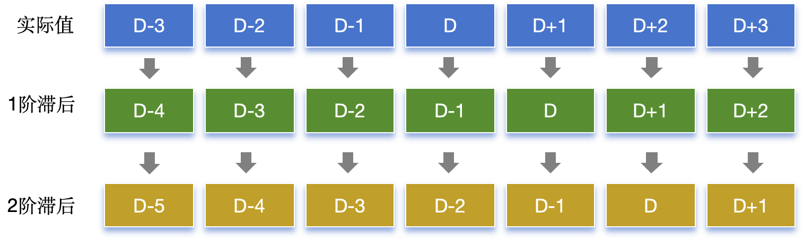
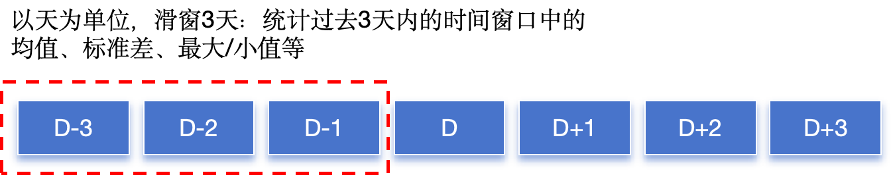

# 时序特征构建

时序预测任务本质上是**回归**问题，因此可以采用机器学习方法进行预测。然而，如果仅仅依赖原始属性特征来训练机器学习模型，往往难以取得理想的预测效果，甚至有时表现不如简单的滑动平均方法。究其原因在于忽视了时间序列数据的固有特性，没有充分挖掘和构造有助于提升模型表现的时序特征。

这一节我们来学习如何构造时序特征，帮助机器学习模型更好地捕捉序列数据中的规律，从而提升预测的准确性。

以下为本节目录：

- [时序特征构建](#时序特征构建)
  - [1. 时间特征](#1-时间特征)
    - [节假日判断](#节假日判断)
  - [2. 滞后特征](#2-滞后特征)
    - [2.1. 滞后特征的构建方式](#21-滞后特征的构建方式)
    - [2.2. 使用 `shift()` 函数构建滞后特征](#22-使用-shift-函数构建滞后特征)
      - [`shift()` 参数含义](#shift-参数含义)
    - [2.3. 滞后特征代码示例](#23-滞后特征代码示例)
    - [2.4. 滞后特征的作用](#24-滞后特征的作用)
    - [2.5. 高阶滞后特征构建](#25-高阶滞后特征构建)
      - [多滞后期特征：](#多滞后期特征)
      - [特征交叉：](#特征交叉)
  - [3. 差分特征](#3-差分特征)
    - [3.1. 什么是差分特征？](#31-什么是差分特征)
    - [3.2. 为什么需要差分特征？](#32-为什么需要差分特征)
      - [使用差分特征的好处：](#使用差分特征的好处)
    - [3.3. 差分特征的构建方式](#33-差分特征的构建方式)
      - [`diff()` 函数的基本用法：](#diff-函数的基本用法)
      - [差分特征的代码示例：](#差分特征的代码示例)
      - [代码解释：](#代码解释)
    - [3.4. 差分特征的实际应用场景](#34-差分特征的实际应用场景)
      - [3.4.1. ARIMA 模型中的差分：](#341-arima-模型中的差分)
      - [3.4.2. 机器学习中的差分：](#342-机器学习中的差分)
    - [3.5. 差分特征的注意事项](#35-差分特征的注意事项)
  - [4. 滑动窗口统计特征](#4-滑动窗口统计特征)
    - [4.1. 什么是滑动窗口统计特征？](#41-什么是滑动窗口统计特征)
    - [4.2. 为什么需要滑动窗口统计特征？](#42-为什么需要滑动窗口统计特征)
    - [4.3. 滑动窗口统计特征的构建方式](#43-滑动窗口统计特征的构建方式)
      - [`rolling()` 函数的基本用法：](#rolling-函数的基本用法)
    - [4.4. 滑动窗口统计特征的常见类型](#44-滑动窗口统计特征的常见类型)
      - [代码示例：](#代码示例)
      - [代码输出：](#代码输出)
    - [4.5. 滑动窗口大小的选择](#45-滑动窗口大小的选择)
    - [4.6. 滑动窗口的延伸：加权滑动平均](#46-滑动窗口的延伸加权滑动平均)
    - [4.7. 滑动窗口的注意事项](#47-滑动窗口的注意事项)
  - [5. 时序特征构建中的注意事项](#5-时序特征构建中的注意事项)
    - [5.1. 特征穿越](#51-特征穿越)
    - [5.2. 滞后特征与滑动窗口特征的窗口大小选择](#52-滞后特征与滑动窗口特征的窗口大小选择)
    - [5.3. 数据的缺失值处理](#53-数据的缺失值处理)
  - [6. 完整代码示例](#6-完整代码示例)
    - [代码说明](#代码说明)
    - [总结](#总结)

## 1. 时间特征

在时间序列数据中，时间信息本身可以为模型提供有用的特征。通过提取与时间相关的信息，模型能够识别出潜在的周期性规律和趋势。常见的时间特征有：

- **日期和时间信息提取**：
  - **年份、月份、日期**：这些特征适合用于识别长期趋势或年度季节性。例如，电力需求可能每年有显著的波动，天气数据则可能按月呈现特定的模式。
  - **小时、分钟**：这类特征对于短时间间隔的数据很重要，能够捕捉日内的变化。电力消耗、交通流量等领域的日内模式可以通过这些特征捕捉。
  - **星期几、周数**：常用于分析周期间的周期性。例如，零售业或交通系统中，工作日和周末的行为差异很大。

- **周期性特征**：
  - **季度、月份**：对于一些行业和数据集，季度性或月度周期性是常见的。例如，销售数据可能在不同季度有显著的不同。
  - **节假日标记**：在许多领域，节假日可能会对业务有显著影响，例如零售或航空业。在构建模型时，可以添加节假日的标记作为特征。

代码示例：

```python
import pandas as pd

# 创建一个包含时间戳的数据框
data = {'timestamp': pd.date_range(start='2024-01-01', periods=10, freq='D')}
df = pd.DataFrame(data)

# 提取时间特征
df['year']        = df['timestamp'].dt.year          # 提取年份
df['month']       = df['timestamp'].dt.month        # 提取月份
df['day']         = df['timestamp'].dt.day            # 提取日期
df['day_of_week'] = df['timestamp'].dt.dayofweek  # 提取星期几 (0 = 周一, 6 = 周日)
df['is_weekend']  = df['day_of_week'].isin([5, 6]) # 是否是周末
df['hour']        = df['timestamp'].dt.hour          # 提取小时
df['is_holiday']  = df['timestamp'].isin(['2024-01-01'])  # 根据假日列表添加特征

print(df)
```

### 节假日判断

对于节假日的判断，可以安装 `chinese-calendar` 库来专门处理中国的节假日和工作日。安装方法：
```bash
pip install chinese-calendar
```

安装完成后，可以结合 `pandas` 和 `chinese-calendar` 库来判断中国假期：

```python
import pandas as pd
import chinese_calendar as cc  # 导入chinese-calendar库

# 创建一个包含时间戳的数据框
data = {'timestamp': pd.date_range(start='2024-10-01', periods=15, freq='D')}
df   = pd.DataFrame(data)

# 定义一个函数，判断某一天是否是中国的假期
def is_holiday(date):
    return cc.is_holiday(date)  # 返回True或False

# 定义一个函数，判断某一天是否是调休日
def is_workday(date): 
    return cc.is_workday(date)  # 返回True或False

# 应用到数据框
df['is_holiday'] = df['timestamp'].apply(is_holiday)  # 判断是否为假期
df['is_workday'] = df['timestamp'].apply(is_workday)  # 判断是否为工作日

print(df)
```

输出结果如下：

```plaintext
    timestamp  is_holiday  is_workday
0  2024-10-01        True       False
1  2024-10-02        True       False
2  2024-10-03        True       False
3  2024-10-04        True       False
4  2024-10-05        True       False
5  2024-10-06        True       False
6  2024-10-07        True       False
7  2024-10-08       False        True
8  2024-10-09       False        True
9  2024-10-10       False        True
10 2024-10-11       False        True
11 2024-10-12       False        True
12 2024-10-13        True       False
13 2024-10-14       False        True
14 2024-10-15       False        True
```

这样就可以避免手动维护假期列表，并且可以动态适应不同年份的假期和调休安排。

---

## 2. 滞后特征

**时间序列滞后特征**是构造时序预测模型时的一种常见特征，主要用于**捕捉时间序列数据的自相关性**。
  
滞后特征的构建方式是通过将过去时刻的值作为当前时间点的预测输入，例如将D-1天的信息给到D天，D-2天的信息给到D-1天。这种方法非常适合应用于机器学习模型进行时间序列预测，因为它可以使模型更好地利用历史信息进行预测。

滞后特征通常通过 `pandas` 中的 `shift()` 函数来实现。

### 2.1. 滞后特征的构建方式

在时间序列中，假设你有一组日期和对应的数值，你可以将前几天的数值作为新的特征，帮助模型预测当前的数值。



例如：

```plaintext
日期         实际值  1阶滞后  2阶滞后
2024-01-01  100  NaN  NaN
2024-01-02  105  100  NaN
2024-01-03  110  105  100
2024-01-04  115  110  105
2024-01-05  120  115  110
```

在上面的例子中：
- “滞后1期”表示把前一天的值作为今天的一个特征；
- “滞后2期”表示把前两天的值作为今天的一个特征。

### 2.2. 使用 `shift()` 函数构建滞后特征

`shift()` 是 `pandas` 用来创建滞后特征的核心函数，它将数据沿某个轴移动一段时间。

#### `shift()` 参数含义
```python
Series.shift(periods=1, freq=None, axis=0, fill_value=None)
```

- **`periods`**：移动的周期数。默认是 `1`，即向前移动一个单位。如果设为负数，则表示向后移动。
- **`freq`**：如果指定了时间序列的频率（如'D', 'M'等），那么会按照这个频率来移动时间索引，而不是移动数据。
- **`axis`**：指定沿哪个轴进行移动，默认为 `0`，即沿行移动。
- **`fill_value`**：当移动之后产生的空值，可以用 `fill_value` 指定的值进行填充。

### 2.3. 滞后特征代码示例

下面是一个使用 `shift()` 函数来构建滞后特征的例子：

```python
import pandas as pd

# 构造时间序列数据
data = {'date': pd.date_range(start='2024-01-01', periods=5, freq='D'),
        'value': [100, 105, 110, 115, 120]}
df = pd.DataFrame(data)

# 设置日期为索引
df.set_index('date', inplace=True)

# 创建滞后特征（滞后1期和滞后2期）
df['lag_1'] = df['value'].shift(1)  # 滞后1期
df['lag_2'] = df['value'].shift(2)  # 滞后2期

print(df)
```

运行结果如下：

```plaintext
            value  lag_1  lag_2
date                            
2024-01-01    100    NaN    NaN
2024-01-02    105  100.0    NaN
2024-01-03    110  105.0  100.0
2024-01-04    115  110.0  105.0
2024-01-05    120  115.0  110.0
```

在这个例子中，`lag_1` 是前一天的值，`lag_2` 是前两天的值。这两个滞后特征可以用作机器学习模型的输入。

### 2.4. 滞后特征的作用

滞后特征在时间序列预测中起到以下作用：
- **捕捉自相关性**：大多数时间序列具有自相关性，过去的值对当前值有影响。滞后特征可以帮助模型利用这一信息。
- **丰富模型输入**：通过引入多期滞后特征，模型能够看到更长时间跨度内的数据，有助于捕捉长短期趋势。
  
滞后特征可以结合其他特征（如时间特征）一起使用，来提升模型的预测效果。

### 2.5. 高阶滞后特征构建

如果需要构建更复杂的滞后特征（例如创建不同周期的滞后特征、季节性特征等），可以通过以下方式实现：

#### 多滞后期特征：
```python
# 构建滞后特征
lags = [1, 2, 3]
for lag in lags:
    df[f'lag_{lag}'] = df['value'].shift(lag)
```

#### 特征交叉：
可以结合滞后特征与其他特征构建一个新的特征，例如：

```python
# 结合时间特征构建
df['day_of_week'] = df.index.dayofweek
df['lag_1'] = df['value'].shift(1)
df['lag_1_dow'] = df['lag_1'] * df['day_of_week']  # 结合星期几和滞后特征
```

---

## 3. 差分特征
**差分特征**是时间序列分析和预测中的一个重要特征，它通过计算相邻数据点之间的差值，帮助捕捉序列中的趋势性和季节性变化。差分特征常用于消除时间序列中的趋势和季节性影响，使得序列变得平稳，从而便于后续建模和预测。

### 3.1. 什么是差分特征？

差分特征（Differencing）指的是计算时间序列数据点之间的差值。对于时间序列中的每一个数据点，计算它与前一个或前几个数据点的差值，生成一个新的特征。

- **一阶差分**：
  一阶差分是最常见的差分形式，它帮助消除线性趋势。当前值减去前一时刻的值，捕捉短期变化。公式为：
  $$
  D_t = X_t - X_{t-1}
  $$
  其中 \(D_t\) 是一阶差分，\(X_t\) 是当前值，\(X_{t-1}\) 是前一个时刻的值。

- **多阶差分**：
  对于某些具有复杂趋势的时间序列，可能需要进行多阶差分。例如，进行二阶差分能够消除二次趋势。
  $$
  D^{(2)}_t = D_t - D_{t-1}
  $$


### 3.2. 为什么需要差分特征？

时间序列数据通常表现为非平稳性，意味着它的均值、方差或自相关结构随着时间变化。例如，许多经济数据会随着时间表现出增长趋势，或者许多自然现象会表现出周期性波动。这些趋势和季节性会影响预测模型的效果。

通过差分操作，可以去除这种趋势性和季节性，使得时间序列更加平稳（即数据的均值和方差在不同时间段内更加一致），从而提升模型的预测效果。

#### 使用差分特征的好处：
- **消除趋势和季节性**：通过差分，趋势和周期性会被削弱或消除，使模型聚焦于序列中的真正变化。
- **提升建模效果**：非平稳序列通常难以建模，而平稳序列更适合用于预测模型如 ARIMA、机器学习模型等。
- **便于捕捉短期变化**：差分特征反映的是相邻数据点之间的变化，可以帮助模型更好地理解短期波动。

### 3.3. 差分特征的构建方式

差分特征可以通过 `pandas` 的 `diff()` 函数轻松构建。`diff()` 函数的作用是对时间序列进行差分，计算每个数据点与前面若干个数据点的差值。

#### `diff()` 函数的基本用法：

```python
Series.diff(periods=1)
```

- **`periods`**：差分的周期，表示与前几个时刻进行差分，默认为1（即与前一个时刻差分）。可以设定其他值进行多阶差分。

#### 差分特征的代码示例：

假设我们有一个时间序列数据集，数据如下：

```python
import pandas as pd

# 创建时间序列数据
data = {'date': pd.date_range(start='2024-01-01', periods=5, freq='D'),
        'value': [100, 105, 110, 120, 130]}
df = pd.DataFrame(data)

# 设置日期为索引
df.set_index('date', inplace=True)

# 一阶差分（当前值减去前一天的值）
df['diff_1'] = df['value'].diff(periods=1)

# 二阶差分（计算一阶差分的差分）
df['diff_2'] = df['diff_1'].diff(periods=1)

print(df)
```

结果输出：

```plaintext
            value  diff_1  diff_2
date                              
2024-01-01    100      NaN      NaN
2024-01-02    105      5.0      NaN
2024-01-03    110      5.0      0.0
2024-01-04    120     10.0      5.0
2024-01-05    130     10.0      0.0
```

在这个例子中：
- `diff_1` 是一阶差分，表示当天的值减去前一天的值。
- `diff_2` 是二阶差分，表示一阶差分的差分，用于捕捉更复杂的变化模式。

#### 代码解释：
1. `df['value'].diff(periods=1)`：计算每个时间点和前一个时间点之间的差值，这是我们常说的一阶差分。
2. `df['diff_1'].diff(periods=1)`：再对一阶差分进行一次差分，得到二阶差分。这可以捕捉序列中更复杂的非线性变化。

### 3.4. 差分特征的实际应用场景

差分特征广泛用于时间序列的多种预测模型中，尤其在 ARIMA 和机器学习模型中，差分特征可以消除趋势和季节性影响。

#### 3.4.1. ARIMA 模型中的差分：
在 ARIMA 模型中，`I` 代表差分（integrated）。ARIMA 模型通过差分将非平稳的时间序列转化为平稳的序列，再进行自回归和移动平均建模。差分的阶数决定了模型的复杂度和数据的平稳性。

#### 3.4.2. 机器学习中的差分：
在基于机器学习的时间序列预测中，差分特征常用于构建新特征来增强模型的表现。它捕捉相邻时间点之间的变化，能帮助模型识别短期趋势和波动，尤其在回归模型中非常有用。

### 3.5. 差分特征的注意事项

在使用差分特征时，需要注意以下几点：
- **差分会导致数据量减少**：每增加一次差分操作，都会导致数据的最前面几行变为 `NaN`，因为差分计算需要前一个或多个数据点。
- **差分可能过度平滑数据**：在某些情况下，多次差分可能会过度消除序列中的信息，使得模型难以捕捉有效的变化。因此，差分的阶数需要根据数据特性进行合理选择。
- **季节性差分**：如果数据存在显著的季节性，可以选择使用季节性差分（即按季节周期进行差分），例如每12个月差分一次的月度数据。

---

## 4. 滑动窗口统计特征

**滑动窗口统计特征**（Rolling Window Features）是时间序列特征工程中的另一种重要技术，它通过在时间序列上应用一个固定大小的滑动窗口，并计算窗口内的统计特征，从而捕捉局部的趋势和变化。这种方法能够提取数据在短期内的变化特征，增强机器学习模型的预测能力。

### 4.1. 什么是滑动窗口统计特征？

滑动窗口统计特征是指在一个固定长度的窗口（window）内，对窗口中的数据进行计算，提取诸如均值、标准差、最大值、最小值等统计特征。随着窗口在时间序列上移动，每个窗口对应一个计算结果，从而生成新的特征。如下图所示：



滑动窗口通过局部视角分析时间序列的变化，能够反映局部的趋势、波动性或极值等信息。窗口长度和滑动步长是两个关键参数，它们决定了统计特征的平滑程度和时间粒度。

### 4.2. 为什么需要滑动窗口统计特征？

滑动窗口特征可以帮助我们捕捉局部的短期波动、趋势和波动性。特别是在非平稳时间序列中，序列的局部特征可能比全局特征更具有预测意义。例如，在股票市场中，短期的价格波动可能比长期趋势更能影响未来价格预测。

滑动窗口统计特征的优势在于：
- **平滑序列中的噪声**：通过计算局部统计值，可以减小时间序列中的噪声，突出整体趋势。
- **捕捉局部变化**：与全局特征相比，滑动窗口能够捕捉到时间序列中更短期的变化或模式。
- **增强模型的预测能力**：通过增加这些统计特征，机器学习模型能够更好地识别序列中的重要模式。

### 4.3. 滑动窗口统计特征的构建方式

在 `pandas` 中，我们可以使用 `rolling()` 函数来构建滑动窗口统计特征。`rolling()` 函数允许我们指定窗口大小，并在窗口内计算各种统计特征，如均值、标准差、最大值、最小值、方差等。

#### `rolling()` 函数的基本用法：

```python
Series.rolling(window, min_periods=1, center=False)
```

- **`window`**：滑动窗口的大小，即一次包含多少个数据点进行统计。
- **`min_periods`**：窗口中至少需要多少个非缺失值，才能进行计算。默认为1。
- **`center`**：布尔值，表示是否将窗口居中。如果为 `True`，则结果将对齐到窗口中心位置；如果为 `False`，则结果对齐到窗口的右端点。

### 4.4. 滑动窗口统计特征的常见类型

我们可以通过滑动窗口计算各种常见的统计特征，以下是一些常见的例子：

- **滑动均值**：反映窗口内数据的平均水平，可以平滑序列。
- **滑动标准差**：反映窗口内数据的波动性。
- **滑动最大值和最小值**：可以识别序列在短期内的极值变化。
- **滑动方差**：用于度量窗口内数据的波动范围。
- **滑动中位数**：提供了对局部中心趋势的鲁棒估计。

#### 代码示例：

```python
import pandas as pd

# 创建时间序列数据
data = {'date': pd.date_range(start='2024-01-01', periods=10, freq='D'),
        'value': [100, 105, 110, 120, 130, 125, 135, 140, 145, 150]}
df = pd.DataFrame(data)

# 设置日期为索引
df.set_index('date', inplace=True)

# 滑动窗口的均值（窗口大小为3）
df['rolling_mean'] = df['value'].rolling(window=3).mean()

# 滑动窗口的标准差（窗口大小为3）
df['rolling_std'] = df['value'].rolling(window=3).std()

# 滑动窗口的最大值（窗口大小为3）
df['rolling_max'] = df['value'].rolling(window=3).max()

# 滑动窗口的最小值（窗口大小为3）
df['rolling_min'] = df['value'].rolling(window=3).min()

print(df)
```

#### 代码输出：

```plaintext
            value  rolling_mean  rolling_std  rolling_max  rolling_min
date                                                                   
2024-01-01    100          NaN          NaN        NaN         NaN
2024-01-02    105        102.5     3.535534       105.0       100.0
2024-01-03    110        105.0     5.000000       110.0       100.0
2024-01-04    120        111.7     7.637626       120.0       105.0
2024-01-05    130        120.0    10.000000       130.0       110.0
2024-01-06    125        125.0     5.000000       130.0       120.0
2024-01-07    135        130.0     5.000000       135.0       125.0
2024-01-08    140        133.3     7.637626       140.0       125.0
2024-01-09    145        140.0     7.637626       145.0       135.0
2024-01-10    150        145.0     7.637626       150.0       140.0
```

在这个例子中：
- **`rolling_mean`** 是滑动窗口内的均值，随着窗口的移动，均值逐渐平滑序列中的短期波动。
- **`rolling_std`** 是滑动窗口内的标准差，反映了窗口内数据的波动性。
- **`rolling_max`** 和 **`rolling_min`** 分别是窗口内的最大值和最小值，帮助我们识别局部极值。


### 4.5. 滑动窗口大小的选择

窗口大小（`window`）是滑动窗口特征中的关键参数，它决定了统计特征的平滑程度。窗口过大可能会导致序列过度平滑，丢失重要的短期信息；窗口过小则可能无法有效去除噪声。因此，窗口大小需要根据具体任务和数据的特性进行选择。

常见的选择方法包括：
- **经验法则**：根据业务场景和常识选择合理的窗口长度。例如，在股票预测中，5天、20天和200天的移动平均线常被使用。
- **交叉验证**：在构建模型时，可以通过交叉验证自动调整窗口大小，找到最优的参数。

### 4.6. 滑动窗口的延伸：加权滑动平均

除了常规的滑动窗口统计特征，还可以使用 **加权滑动平均**（Weighted Moving Average, WMA）来赋予窗口内不同数据点不同的权重。通常，离当前时刻越近的数据点权重越大，而较早的数据点权重较小。这在需要更关注最近数据变化的场景中非常有用。

```python
# 使用加权滑动平均
df['ewm_mean'] = df['value'].ewm(span=3, adjust=False).mean()

print(df[['value', 'ewm_mean']])
```

在这个例子中，`ewm()` 函数用于计算加权滑动平均，`span` 参数控制权重的衰减速率。

### 4.7. 滑动窗口的注意事项

使用滑动窗口时，需要注意以下几点：
- 数据量大时，计算滑动窗口特征可能会比较耗时，可以考虑优化计算效率或减少特征数量。
- 滑动窗口长度需要根据实际情况调整，避免过度平滑或不足以捕捉短期变化。
- 在模型训练过程中，应避免未来数据泄漏（lookahead bias），即滑动窗口不应包含未来时刻的数据。

---


## 5. 时序特征构建中的注意事项

在构建时序特征时，有几个重要的注意事项需要留意，以确保特征的有效性和模型预测的可靠性。

### 5.1. 特征穿越
特征穿越是时间序列数据建模中的一个常见问题，它指的是在构建特征时，无意间**使用了未来的数据**。由于时间序列是具有时间依赖性的，如果在训练模型时使用了未来时刻的数据进行预测，模型会产生**过拟合**问题，导致其在真实预测中表现不佳。

**如何避免特征穿越**：
- **滞后特征的正确使用**：滞后特征是非常常见的时序特征，但一定要确保这些滞后特征只使用过去的数据，不能使用未来时刻的值来构建滞后特征。
- **滑动窗口特征的注意**：在计算滑动窗口特征时，同样需要确保窗口只包含过去的值，而不应包含未来的值。例如，使用 `rolling()` 计算窗口时，不要包含未来的时刻。
- **严格划分训练集和测试集**：在进行模型训练时，尤其是交叉验证中，确保将时间维度上的数据切分开，训练数据只能包含早于测试数据的时刻点。


### 5.2. 滞后特征与滑动窗口特征的窗口大小选择
不同任务对滞后特征和滑动窗口的窗口大小要求不同。选择过大的窗口会导致丢失短期变化的细节，选择过小的窗口则可能导致模型过度拟合局部的波动。

**如何选择合适的窗口大小**：
- **经验法则**：根据实际的时间序列数据特点（如日、周、月等）选择窗口大小。
- **超参数优化**：通过交叉验证等方法，对窗口大小进行调优。

### 5.3. 数据的缺失值处理
在构建时序特征时，滑动窗口或者滞后特征生成的过程中，可能会导致数据缺失，特别是在数据集的前几个时刻。需要合理处理这些缺失值，以免影响模型训练。

**如何处理缺失值**：
- **填补缺失值**：使用前向填充、后向填充、均值填充等方法补全数据。
- **忽略缺失值**：对于较少的缺失值，可以考虑删除缺失值行。


## 6. 完整代码示例

下面展示如何结合滞后特征、滑动窗口特征以及时间特征，并使用机器学习模型进行训练和预测。

```python
import pandas as pd
import numpy as np
from sklearn.model_selection import train_test_split
from sklearn.ensemble import RandomForestRegressor
from sklearn.metrics import mean_squared_error

# 生成模拟时间序列数据
np.random.seed(42)
data = pd.DataFrame({
    'date': pd.date_range(start='2024-01-01', periods=100, freq='D'),
    'value': np.random.randint(50, 150, size=100)
})
data.set_index('date', inplace=True)

# 1. 构造滞后特征
for lag in range(1, 4):  # 构造1到3天的滞后特征
    data[f'lag_{lag}'] = data['value'].shift(lag)

# 2. 构造滑动窗口统计特征
data['rolling_mean_3'] = data['value'].rolling(window=3).mean()
data['rolling_std_3'] = data['value'].rolling(window=3).std()

# 3. 构造时间特征
data['day_of_week'] = data.index.dayofweek
data['day_of_month'] = data.index.day
data['month'] = data.index.month

# 4. 去掉缺失值（由于滞后和滚动窗口导致的缺失）
data.dropna(inplace=True)

# 5. 训练集和测试集划分
X = data.drop(columns=['value'])  # 特征
y = data['value']  # 目标
X_train, X_test, y_train, y_test = train_test_split(X, y, test_size=0.2, shuffle=False)  # 保持时间顺序

# 6. 训练机器学习模型（随机森林回归）
model = RandomForestRegressor(n_estimators=100, random_state=42)
model.fit(X_train, y_train)

# 7. 模型预测
y_pred = model.predict(X_test)

# 8. 评估模型表现
mse = mean_squared_error(y_test, y_pred)
print(f'Mean Squared Error: {mse}')

# 展示部分预测结果
results = pd.DataFrame({'Actual': y_test, 'Predicted': y_pred})
print(results.head())
```

### 代码说明

1. **滞后特征**：使用 `shift()` 函数构造了1至3天的滞后特征，捕捉前几天的值对当前时刻的影响。
2. **滑动窗口特征**：使用 `rolling()` 函数计算了3天的滑动平均值和标准差，反映数据的局部趋势和波动性。
3. **时间特征**：提取了星期几、月份等时间信息，帮助模型理解时间上的周期性特征。
4. **数据切分**：按时间顺序划分了训练集和测试集，确保模型只在过去数据上进行训练，避免未来数据泄露。
5. **模型训练和预测**：使用 `RandomForestRegressor` 训练随机森林模型，并对测试集进行预测。

### 总结

构建时序特征时需要格外注意特征穿越、数据漏泄等问题，合理选择滞后特征、滑动窗口特征和时间特征能显著提升模型的预测性能。通过上述代码示例，我们可以看到如何结合多种时序特征，并应用机器学习模型进行预测。在实际应用中，可以根据具体任务对特征进行进一步优化和调整。