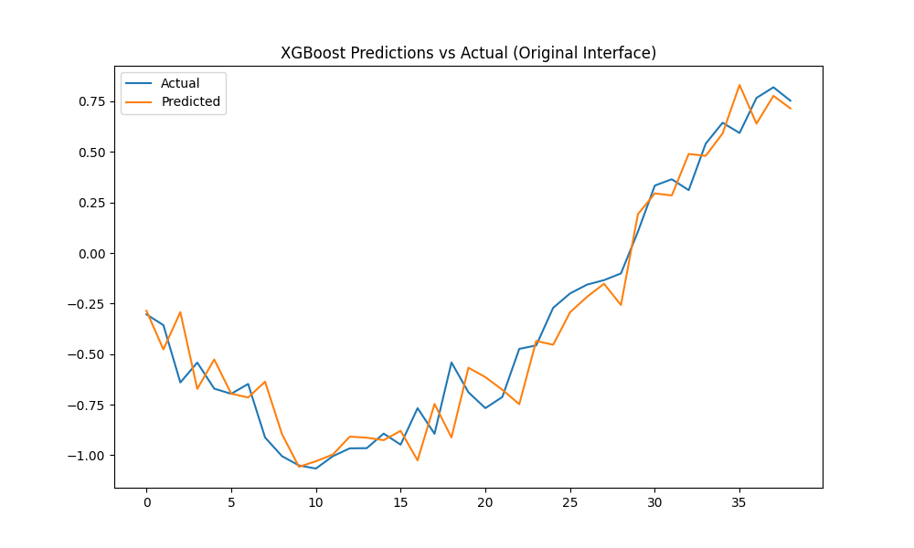
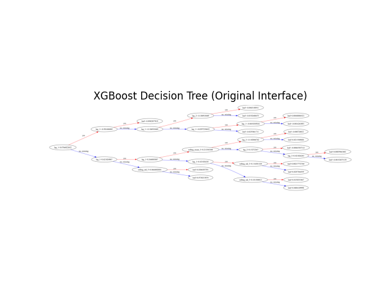
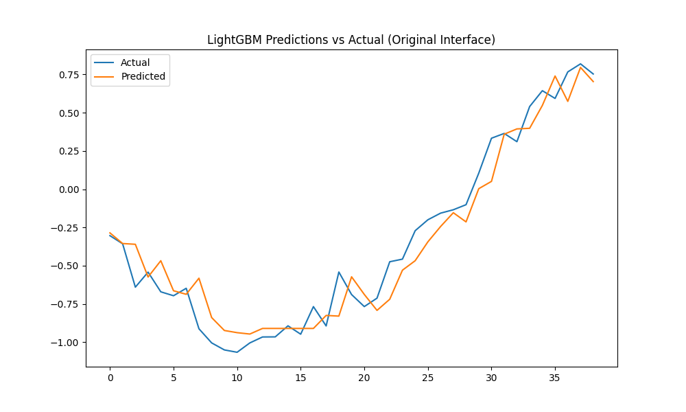
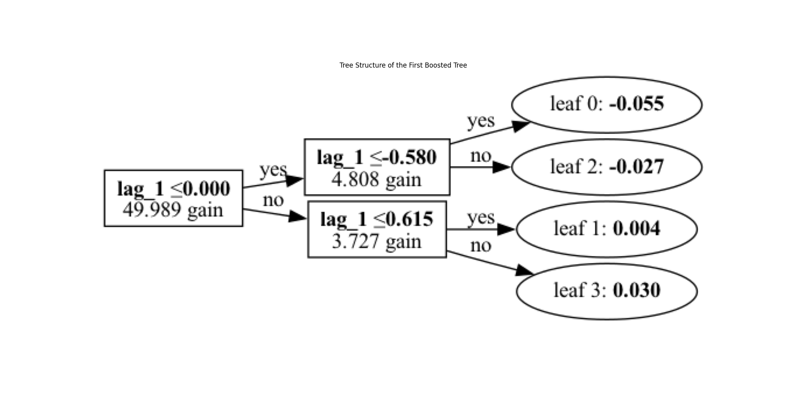

# 梯度提升树

本节将介绍几种常见的梯度提升树模型（XGBoost、LightGBM和CatBoost）以及他们在时序预测上的应用。

本文目录：
- [梯度提升树](#梯度提升树)
  - [1. Bagging和Boosting的区别](#1-bagging和boosting的区别)
    - [1.1 Bagging：让模型们“各自发挥”](#11-bagging让模型们各自发挥)
    - [1.2 Boosting：让模型们“互相帮忙”](#12-boosting让模型们互相帮忙)
    - [1.3 形象对比](#13-形象对比)
    - [1.4 核心差异](#14-核心差异)
  - [2. 梯度提升决策树（GBDT）](#2-梯度提升决策树gbdt)
    - [2.1  基本原理](#21--基本原理)
    - [2.2 梯度提升的思想](#22-梯度提升的思想)
    - [2.3 损失函数](#23-损失函数)
    - [2.4 树的构建过程](#24-树的构建过程)
    - [2.5 GBDT 的优化策略](#25-gbdt-的优化策略)
    - [2.6 代码示例](#26-代码示例)
      - [可视化决策树](#可视化决策树)
  - [3. XGBoost模型](#3-xgboost模型)
    - [3.1 XGBoost的核心思想](#31-xgboost的核心思想)
    - [3.2 优缺点](#32-优缺点)
    - [3.3 时序预测代码示例](#33-时序预测代码示例)
  - [4. LightGBM模型](#4-lightgbm模型)
    - [4.1 LightGBM的算法原理](#41-lightgbm的算法原理)
    - [4.2 LightGBM和GBDT的区别](#42-lightgbm和gbdt的区别)
    - [4.3 时序预测代码示例](#43-时序预测代码示例)
  - [5. CatBoost模型](#5-catboost模型)
    - [5.1 CatBoost 算法原理](#51-catboost-算法原理)
    - [5.2 CatBoost 和 GBDT 的区别](#52-catboost-和-gbdt-的区别)
    - [5.3 时序预测代码示例](#53-时序预测代码示例)
  - [6. 总结](#6-总结)
    - [6.1. 算法概述](#61-算法概述)
    - [6.2. 主要区别](#62-主要区别)
    - [6.3. 在时序预测中的应用](#63-在时序预测中的应用)


## 1. Bagging和Boosting的区别

Bagging（**Bootstrap Aggregating**）和Boosting是两种常见的集成学习方法，虽然它们都通过组合多个弱学习器来提升模型的表现，但它们的思路和工作方式有着显著不同。

### 1.1 Bagging：让模型们“各自发挥”
Bagging的核心思想是**并行训练多个模型**，这些模型相互之间是独立的。形象点说，Bagging就像是让每个模型都有自己的“舞台”，每个人都有自己的看法，最后把大家的意见综合起来。

**工作原理**：
1. **随机采样**：Bagging首先对训练数据进行有放回的采样（Bootstrap），生成多个不同的子数据集。每个模型只看到一部分数据。
2. **独立训练模型**：每个模型在自己的子数据集上进行独立训练，互不干扰。
3. **投票或平均**：对于分类问题，Bagging通过多数投票方式得到最终预测；对于回归问题，Bagging则通过多个模型的预测结果取平均值。

Bagging的代表算法是**随机森林**（Random Forest），它通过对不同的决策树进行训练，最后综合这些树的预测结果。由于每棵树看到的数据不完全相同，随机森林能够有效降低单个模型的过拟合风险。

### 1.2 Boosting：让模型们“互相帮忙”
Boosting则采用的是**顺序训练**多个模型的策略，每个模型都在尝试修正前一个模型的错误。可以把Boosting看作是让多个模型“排队”上场，每个人都尽力补救前一个人的失误，最终形成一个更强的整体。

**工作原理**：
1. **顺序训练**：Boosting会一个一个地训练模型，每个模型都要重点关注前一个模型做错的地方（错误样本）。
2. **加权调整**：在训练过程中，Boosting会为每个样本赋予权重，前一个模型预测错的样本权重会加大，后续模型会更加关注这些难以预测的样本。
3. **加权组合**：最后，通过加权组合所有模型的预测结果，得到最终的预测。

Boosting的代表算法有**AdaBoost**、**GBDT**（梯度提升树）、**XGBoost**等。Boosting的一个关键优势是它在每次迭代中逐步纠正错误，逐步提高整体的预测能力。

### 1.3 形象对比
假设有一个班级在准备考试，老师们想给出最后的成绩评价。

- **Bagging**的思路就像让班里的所有老师各自批改不同的作业，然后综合所有老师的意见。每个老师都是独立工作的，看不同的作业，最后通过“投票”或“平均分”来给出班级的成绩。这种方式让不同老师的意见互相补充，从而减少个别老师偏见的影响。
  
- **Boosting**的思路则像是一场**接力赛**。第一个老师先批改作业，指出学生的错误；第二个老师则特别关注第一个老师指出的错误，帮助学生改正；第三个老师再根据前面两个老师没改好的地方继续提升。这种方式让每个老师的工作都建立在前一个老师的基础上，不断优化和提高最终的成绩。

### 1.4 核心差异
1. **训练方式**：
   - **Bagging**：并行训练，模型之间相互独立。
   - **Boosting**：顺序训练，每个模型依赖前一个模型。
   
2. **错误修正**：
   - **Bagging**：每个模型单独做自己的事，不关注其他模型的表现。
   - **Boosting**：每个模型都专注于修正前一个模型的错误。

3. **偏差与方差**：
   - **Bagging**：通过减少方差（模型的过拟合）来提升表现，适合高方差的模型，比如决策树。
   - **Boosting**：通过减少偏差（模型对整体趋势的捕捉能力）来提升表现，适合高偏差的情况。

总的来说，**Bagging更关注降低模型的方差**，让模型更加稳健，而**Boosting则更关注减少模型的偏差**，让模型在学习的过程中变得越来越精确。
梯度提升树

## 2. 梯度提升决策树（GBDT）

梯度提升决策树（GBDT）是一种通过构建多个决策树的集成模型。与随机森林的并行树结构不同，GBDT 是**顺序构建树**的。其核心思想是：每棵新树都试图拟合前一棵树的预测误差，最终将多个弱学习器（决策树）组合成一个强学习器。

### 2.1  基本原理

GBDT 的数学模型由多个基学习器（决策树）组成，每个基学习器试图改进前一阶段的预测。其形式为：

\[
F_m(x) = F_{m-1}(x) + \eta \cdot h_m(x)
\]

其中：
- \(F_m(x)\) 是第 \(m\) 轮迭代后的模型。
- \(F_{m-1}(x)\) 是第 \(m-1\) 轮的模型结果。
- \(\eta\) 是学习率，控制每棵新树对模型的贡献大小。
- \(h_m(x)\) 是第 \(m\) 轮训练的决策树，它拟合的是前一轮的残差。

### 2.2 梯度提升的思想

GBDT 是通过**梯度下降**优化损失函数的模型。假设损失函数为 \(L(y, F(x))\)，表示模型预测值 \(F(x)\) 和真实值 \(y\) 之间的差异。在第 \(m\) 次迭代时，GBDT 使用前一轮模型的预测 \(F_{m-1}(x)\) 来计算损失函数的负梯度：

\[
g_m = - \left[ \frac{\partial L(y, F(x))}{\partial F(x)} \right]_{F(x) = F_{m-1}(x)}
\]

然后训练一棵新的决策树来拟合这个梯度 \(g_m\)，并将新的树加到当前模型中。

### 2.3 损失函数

GBDT 能够灵活地适应不同的任务（回归、分类等），因为它的损失函数是可选的。常见的损失函数有：

- **回归任务**：使用均方误差（MSE）作为损失函数：
  
  \[
  L(y, F(x)) = \frac{1}{2} (y - F(x))^2
  \]

- **二分类任务**：使用交叉熵作为损失函数：

  \[
  L(y, F(x)) = -[y \log(p(x)) + (1 - y) \log(1 - p(x))]
  \]

  其中 \(p(x)\) 是模型预测为正类的概率。

### 2.4 树的构建过程

GBDT 的每轮迭代都会构建一棵新的决策树。这棵树并不直接用于预测目标值 \(y\)，而是用于拟合当前模型的残差或梯度。其构建步骤如下：

1. **计算残差/梯度**：基于当前模型的预测结果，计算损失函数的负梯度（残差），作为拟合的目标。
  
2. **拟合残差**：构建一棵决策树，使得它能够尽量拟合残差，学习如何修正模型的预测误差。

3. **更新模型**：将新树的预测结果乘以学习率 \(\eta\)，然后加到当前模型上，形成新的预测模型。

每棵树的深度通常较浅（如深度 3-5），这是为了避免过拟合，保证模型的泛化能力。

### 2.5 GBDT 的优化策略

GBDT 通过一些关键技巧提升了模型的表现和训练效率：

- **学习率**：控制每棵树对最终模型的影响，较低的学习率虽然训练时间更长，但能带来更好的泛化效果。
  
- **子采样**：在每一轮迭代中，GBDT 不使用所有的训练数据，而是随机采样一部分数据进行训练，类似于随机森林的 Bagging 技术。这样可以减少方差，并加速训练过程。

- **正则化**：GBDT 中常见的正则化方法包括对树的叶节点权重进行惩罚，以避免模型过拟合。

---

### 2.6 代码示例

为了帮助理解，下面展示了一个简单的梯度提升决策树模型的构建过程代码示例。

```python
import numpy as np
from sklearn.datasets import make_regression
from sklearn.ensemble import GradientBoostingRegressor
from sklearn.model_selection import train_test_split
from sklearn.metrics import mean_squared_error

# 构建数据集
X, y = make_regression(n_samples=1000, n_features=10, noise=0.1, random_state=42)
X_train, X_test, y_train, y_test = train_test_split(X, y, test_size=0.2, random_state=42)

# 构建GBDT模型
gbdt = GradientBoostingRegressor(n_estimators=100, learning_rate=0.1, max_depth=3, random_state=42)
gbdt.fit(X_train, y_train)

# 进行预测
y_pred = gbdt.predict(X_test)

# 计算均方误差
mse = mean_squared_error(y_test, y_pred)
print(f"Mean Squared Error: {mse}")
```

在上述代码中，我们使用了 `GradientBoostingRegressor` 进行梯度提升树的回归任务。模型通过训练数据构建了 100 棵决策树，并对测试数据进行预测。

#### 可视化决策树

虽然梯度提升是集成学习，但我们可以对其中的某棵决策树进行可视化。使用 `plot_tree` 工具可以绘制某一轮训练的树结构：

```python
from sklearn.tree import plot_tree
import matplotlib.pyplot as plt

# 可视化第一棵树
plt.figure(figsize=(20, 10))
plot_tree(gbdt.estimators_[0, 0], filled=True)
plt.show()
```

---


## 3. XGBoost模型

XGBoost（eXtreme Gradient Boosting）是梯度提升树（GBDT）的一种高效实现，其引入了许多优化技术，使其在训练速度和预测精度方面具有优势，广泛应用于各种机器学习任务，包括分类、回归以及时序预测。相比于传统的GBDT，XGBoost通过更强的正则化手段、并行计算和树结构的优化，使模型在处理大规模数据和复杂特征时更加出色。

### 3.1 XGBoost的核心思想
XGBoost的基本思想与GBDT类似，都是通过迭代地训练一系列弱学习器（通常为决策树），并逐步修正前一轮的误差。但XGBoost在具体实现上有一些优化：
- **正则化项**：XGBoost在目标函数中引入了L1、L2正则化项，以控制模型复杂度，从而防止过拟合。
- **并行化计算**：XGBoost通过对特征进行按列分裂和并行计算加速了模型的训练过程。
- **缺失值处理**：XGBoost能够自动处理数据中的缺失值，不需要提前进行填充操作。
- **分裂点的高效选择**：通过使用“近似算法”找到特征的最佳分裂点，进一步提升了模型的效率。
- **加权的投票机制**：与GBDT相似，XGBoost采用加权投票的方式组合多个决策树的预测结果。


### 3.2 优缺点
- **优点**：
  - 训练速度快，能够处理大规模数据。
  - 在很多任务上有极高的预测精度。
  - 内建的正则化机制能够有效防止过拟合。

- **缺点**：
  - 需要构造特征，无法像RNN或LSTM那样自然地处理时序数据。
  - 对于高度线性的时序数据，表现可能不如ARIMA等传统统计模型。

### 3.3 时序预测代码示例

下面是一个使用XGBoost进行时序预测的代码示例。我们将构造滞后特征，利用XGBoost来进行预测：

```python
import numpy as np
import pandas as pd
import xgboost as xgb
import matplotlib.pyplot as plt
from sklearn.model_selection import train_test_split
from sklearn.metrics import mean_squared_error, mean_absolute_error
from xgboost import XGBRegressor, plot_importance, plot_tree

# 生成模拟的时序数据
np.random.seed(42)
date_range = pd.date_range(start='2024-01-01', periods=200, freq='D')
data       = pd.DataFrame({'value': np.sin(np.arange(200)/10) + np.random.normal(0, 0.1, 200)}, index=date_range)

# 构造滞后特征和滚动统计特征
def create_features(df, target_col, lags, window): 
for lag in range(1, lags+1)                      : 
    df[f'lag_{lag}']             = df[target_col].shift(lag)
    df[f'rolling_mean_{window}'] = df[target_col].shift(1).rolling(window=window).mean()
    df[f'rolling_std_{window}']  = df[target_col].shift(1).rolling(window=window).std()
    df.dropna(inplace=True)
    return df

# 构建特征
lags   = 3  # 滞后3步
window = 5  # 滑动窗口大小为5
data   = create_features(data, 'value', lags, window)

# 构建训练集和测试集
        X       = data.drop(columns=['value'])
        y       = data['value']
X_train, X_test, y_train, y_test = train_test_split(X, y, test_size=0.2, shuffle=False)


## 方式1：原生接口，转换为DMatrix格式
dtrain = xgb.DMatrix(X_train, label=y_train)
dtest  = xgb.DMatrix(X_test, label=y_test)

# 参数设置
params = {
    'objective'    : 'reg:squarederror', # 回归目标
    'max_depth'    : 3,                  # 树的最大深度
    'learning_rate': 0.1,                # 学习率
    'eval_metric'  : 'rmse'             # 评估指标
}

# 训练模型
evals = [(dtrain, 'train'), (dtest, 'eval')]
model = xgb.train(params, dtrain, num_boost_round=100, evals=evals, early_stopping_rounds=10, verbose_eval=False)

# 预测与评估
y_pred = model.predict(dtest)


# ## 方式2：sklearn接口，XGBoost模型
# model = xgb.XGBRegressor(objective='reg:squarederror', n_estimators=100, learning_rate=0.1)
# model.fit(X_train, y_train)
# y_pred = model.predict(X_test)


mse  = mean_squared_error(y_test, y_pred)
rmse = np.sqrt(mse)
mae  = mean_absolute_error(y_test, y_pred)
print(f'MAE: {mae:.4f}, MSE: {mse:.4f}, RMSE: {rmse:.4f}')

# 特征重要性
plt.figure(figsize=(10, 6))
xgb.plot_importance(model, max_num_features=10)
plt.title("Feature Importance (Original XGBoost)")
plt.show()


# 绘制预测值与真实值的对比图
plt.figure(figsize=(10, 6))
plt.plot(y_test.values, label="Actual")
plt.plot(y_pred, label="Predicted")
plt.legend()
plt.title("XGBoost Predictions vs Actual (Original Interface)")
plt.show()


# 绘制决策树
xgb.plot_tree(model, num_trees=0, rankdir="LR")
plt.title("XGBoost Decision Tree (Original Interface)")
plt.show()
```

结果如下：



可以看到XGBoost预测结果还是较为准确的，基本符合真实值的趋势。

XGBoost的树结构图参考如下：




## 4. LightGBM模型

LightGBM（Light Gradient Boosting Machine）是一个高效的梯度提升框架，与GBDT（Gradient Boosting Decision Trees）类似，都是基于梯度提升树的集成学习方法，旨在通过逐步减少误差来提高模型的预测精度。然而，LightGBM在计算效率和内存管理方面进行了多项优化，特别适用于大规模、高维数据的场景。

### 4.1 LightGBM的算法原理
LightGBM主要在以下几个方面进行了创新，使其在梯度提升框架下能够更加快速高效地训练模型：

1. **基于直方的决策树算法（Histogram-based Decision Tree）**
   - LightGBM在构建决策树时采用了直方算法，将连续特征划分为有限的区间（即直方桶），将特征值映射到对应的桶中，从而大幅减少了连续值的比较运算。
   - 这种算法将复杂度降低到 \(O(n)\)，其中 \(n\) 为样本数，因此训练速度显著提升，尤其适合大规模数据。

2. **基于叶子的增长策略（Leaf-wise Growth）**
   - 与GBDT的层级生长（Level-wise）不同，LightGBM采用了基于叶子的生长方式，即每次从叶子中选择增益最大的分裂，从而让决策树变得更加不平衡。
   - 这种方式在保证模型精度的前提下减少了不必要的节点分裂，能够更有效地降低误差。然而，由于树更深，过拟合的风险也随之增加，因此需要控制最大深度。

3. **互斥特征捆绑（Exclusive Feature Bundling）**
   - 对于稀疏数据集，LightGBM会将互斥的稀疏特征（即在同一数据样本中不会同时出现的特征）捆绑在一起，以减少特征维度，从而提高计算效率。

4. **基于数据的并行学习（Parallel Learning）**
   - LightGBM支持数据并行和特征并行，充分利用多核处理器来加速模型训练。在大数据集下，可以通过分布式训练提升计算速度。

### 4.2 LightGBM和GBDT的区别

尽管LightGBM和GBDT同属梯度提升树算法，但它们在构建和训练模型上存在几个关键的不同之处：

| 特性             | GBDT                                                                                       | LightGBM                                                                                 |
|----------------|--------------------------------------------------------------------------------------------|------------------------------------------------------------------------------------------|
| **决策树生长策略** | 层级生长（Level-wise）：每层按顺序分裂所有叶子，树结构较平衡                         | 叶子生长（Leaf-wise）：优先选择增益最大的叶子分裂，树结构更不平衡                          |
| **分裂算法**     | 传统基于每个特征值的精确分裂，计算成本高                                                   | 直方分裂算法，将特征值离散化后再进行分裂，降低了时间和空间复杂度                         |
| **内存消耗**     | 由于采用精确分裂，需要存储和计算所有特征的值，内存占用较大                                 | 采用直方算法和特征捆绑技术，减少内存占用                                                 |
| **并行化支持**   | 不同梯度提升库的并行支持不同；一般而言，传统GBDT的并行效率较低                           | 支持数据并行和特征并行，在分布式系统中速度较快                                            |
| **适用场景**     | 适用于中小规模数据集，需要进行更严格的超参数控制，避免过拟合                               | 尤其适用于大规模数据，稀疏数据，以及需要快速训练和预测的场景，例如推荐系统和时序预测     |

### 4.3 时序预测代码示例
在这个示例中，我们将构造滞后特征和滑动窗口统计特征来完成时序预测任务，并展示如何使用LightGBM的两种接口进行训练：其一是直接使用LightGBM的原生API，其二是使用LightGBM的sklearn接口。最后会绘制模型的特征重要性和一棵示例决策树。

首先，安装 `lightgbm` 和 `graphviz`：
```bash
pip install lightgbm graphviz
```

以下代码展示了LightGBM的2种接口的使用方式。

```python
import lightgbm as lgb
import pandas as pd
import numpy as np
import matplotlib.pyplot as plt
from sklearn.model_selection import train_test_split
from sklearn.metrics import mean_squared_error, mean_absolute_error
from lightgbm import LGBMRegressor

# 生成模拟的时序数据
np.random.seed(42)
date_range = pd.date_range(start='2024-01-01', periods=200, freq='D')
data = pd.DataFrame({'value': np.sin(np.arange(200)/10) + np.random.normal(0, 0.1, 200)}, index=date_range)


# 构造滞后特征和滚动统计特征
def create_features(df, target_col, lags, window):
    for lag in range(1, lags+1):
        df[f'lag_{lag}'] = df[target_col].shift(lag)
    df[f'rolling_mean_{window}'] = df[target_col].shift(1).rolling(window=window).mean()
    df[f'rolling_std_{window}'] = df[target_col].shift(1).rolling(window=window).std()
    df.dropna(inplace=True)
    return df

# 构建特征
lags   = 3  # 滞后3步
window = 5  # 滑动窗口大小为5
data   = create_features(data, 'value', lags, window)

# 分割数据
X = data.drop(columns=['value'])
y = data['value']
X_train, X_test, y_train, y_test = train_test_split(X, y, test_size=0.2, shuffle=False)

# 从训练集划分出验证集（例如，20%的数据用于验证）
X_train, X_val, y_train, y_val = train_test_split(X_train, y_train, test_size=0.2, random_state=42, shuffle=False)


## 方式1：使用LightGBM的原生接口
# 创建LightGBM数据集
train_data = lgb.Dataset(X_train, label=y_train)
val_data   = lgb.Dataset(X_val, label=y_val, reference=train_data)
test_data  = lgb.Dataset(X_test, label=y_test, reference=train_data)

# 设置参数
params = {
    'objective'    : 'regression',
    'metric'       : 'rmse',
    'boosting_type': 'gbdt',
    'num_leaves'   : 31,
    'learning_rate': 0.05,
    'verbose'      : -1
}

# 训练模型
model = lgb.train(
    params,
    train_data,
    num_boost_round       = 100,
    valid_sets            = [train_data, val_data], # 使用训练集和验证集
)

# 预测
y_pred = model.predict(X_test, num_iteration=model.best_iteration)


# ## 方式2：使用sklearn接口
# # 初始化和训练模型
# model = LGBMRegressor(
#     objective='regression',
#     metric='rmse',
#     boosting_type='gbdt',
#     num_leaves=31,
#     learning_rate=0.05,
#     n_estimators=100
# )

# model.fit(X_train, y_train)

# # 预测
# y_pred = model.predict(X_test)


# 评估模型
print(f"RMSE: {mean_squared_error(y_test, y_pred, squared=False)}")
mse  = mean_squared_error(y_test, y_pred)
rmse = np.sqrt(mse)
mae  = mean_absolute_error(y_test, y_pred)
print(f'MAE: {mae:.4f}, MSE: {mse:.4f}, RMSE: {rmse:.4f}')

# 绘制特征重要性
lgb.plot_importance(model, max_num_features=10, importance_type='split', figsize=(8, 6))
plt.title("Feature Importance (Original API)")
plt.show()


# 绘制决策树
lgb.plot_tree(model, tree_index=0, figsize=(20, 10), show_info=['split_gain'])
plt.title("Tree Structure of the First Boosted Tree")
plt.show()

# 绘制预测值与真实值的对比图
plt.figure(figsize=(10, 6))
plt.plot(y_test.values, label="Actual")
plt.plot(y_pred, label="Predicted")
plt.legend()
plt.title("LightGBM Predictions vs Actual (Original Interface)")
plt.show()
```

结果如下：



LightGBM的第一棵树的结构图如下：



## 5. CatBoost模型

### 5.1 CatBoost 算法原理

**CatBoost**（Categorical Boosting）是一种高效的梯度提升树（GBDT）算法，专为处理类别特征而设计。CatBoost 在 GBDT 的基础上进行了多项改进，以下是其核心原理和特点：

1. **处理类别特征**：
   - CatBoost 能够直接处理类别特征，无需进行额外的预处理（如独热编码）。它通过将类别特征转换为数值特征的统计信息来优化模型，避免了类别特征过多导致的维度灾难。

2. **顺序性学习**：
   - CatBoost 使用顺序性学习的方式，依据数据的排序顺序来计算类别特征的统计信息。具体来说，它会根据当前样本的标签对类别特征进行统计，从而更好地捕捉目标变量的分布，减少模型的过拟合。

3. **均匀化特征**：
   - CatBoost 在构建树时会使用均匀化特征（Ordered Target Statistics），通过排除当前样本的影响，避免信息泄露。

4. **使用对称树结构**：
   - CatBoost 在树的结构上采用了对称树的方法。即每棵树的分裂节点结构是相同的，这样可以提高训练速度和内存利用率。

5. **高效的训练过程**：
   - CatBoost 采用了多线程并行处理，优化了树的构建过程，使得模型训练更快速。

6. **自动化超参数调优**：
   - CatBoost 内置了多种超参数调优方法，用户只需指定基本参数，其他参数将自动优化，提高了模型的易用性。

### 5.2 CatBoost 和 GBDT 的区别

| 特征         | GBDT                       | CatBoost                   |
|--------------|----------------------------|----------------------------|
| 处理类别特征 | 需手动预处理（如独热编码） | 自动处理，无需预处理       |
| 训练速度     | 较慢，尤其是在类别特征多时 | 更快，采用对称树结构和多线程 |
| 过拟合控制   | 易受类别特征的影响         | 通过顺序性学习和均匀化特征控制过拟合 |
| 性能         | 在某些情况下性能较强       | 在处理类别特征时表现优越   |
| 超参数调优   | 需手动调整                 | 内置自动调优               |


### 5.3 时序预测代码示例

以下为Catboost用于时序预测的代码示例：
```python
import numpy as np
import matplotlib.pyplot as plt
import pandas as pd
from sklearn.model_selection import train_test_split
from catboost import CatBoostRegressor
from sklearn.metrics import mean_squared_error, mean_absolute_error

# 生成模拟的时序数据
np.random.seed(42)
date_range   = pd.date_range(start='2024-01-01', periods=200, freq='D')
data         = pd.DataFrame({'value': np.sin(np.arange(200)/10) + np.random.normal(0, 0.1, 200)}, index=date_range)
print(data.head())

# 构造滞后特征和滚动统计特征
def create_features(df, target_col, lags, window): 
for lag in range(1, lags+1)                      : 
    df[f'lag_{lag}']             = df[target_col].shift(lag)
    df[f'rolling_mean_{window}'] = df[target_col].shift(1).rolling(window=window).mean()
    df[f'rolling_std_{window}']  = df[target_col].shift(1).rolling(window=window).std()
    df.dropna(inplace=True)
    return df

# 构建特征
lags   = 3  # 滞后3步
window = 5  # 滑动窗口大小为5
data   = create_features(data, 'value', lags, window)

# 构建训练集和测试集
X  = data.drop(columns=['value'])
y  = data['value']
X_train, X_test, y_train, y_test = train_test_split(X, y, test_size=0.2, shuffle=False)


# CatBoost模型训练（sklearn接口）
model = CatBoostRegressor(iterations=100, learning_rate=0.1, depth=3, verbose=0)
model.fit(X_train, y_train)

# 预测
y_pred = model.predict(X_test)

# 评估模型
mse  = mean_squared_error(y_test, y_pred)
rmse = np.sqrt(mse)
mae  = mean_absolute_error(y_test, y_pred)
print(f'MAE: {mae:.4f}, MSE: {mse:.4f}, RMSE: {rmse:.4f}')

# 特征重要性
feature_importances = model.get_feature_importance()
feature_names       = X.columns
importance_df       = pd.DataFrame({'Feature': feature_names, 'Importance': feature_importances})
importance_df       = importance_df.sort_values(by='Importance', ascending=False)

# 可视化特征重要性
plt.figure(figsize=(10, 6))
plt.barh(importance_df['Feature'], importance_df['Importance'])
plt.xlabel('Importance')
plt.title('CatBoost Feature Importance')
plt.show()

# 绘制预测值与真实值的对比图
plt.figure(figsize=(10, 6))
plt.plot(y_test.values, label="Actual")
plt.plot(y_pred, label="Predicted")
plt.legend()
plt.title("CatBoost Predictions vs Actual")
plt.show()
```


## 6. 总结


### 6.1. 算法概述
- **GBDT（Gradient Boosting Decision Tree）**：
  - GBDT 是一种基于决策树的梯度提升算法，采用加法模型和前向分步算法。
  - 每棵树是为了减少前一棵树的误差而训练的，主要用于回归和分类任务。

- **XGBoost（Extreme Gradient Boosting）**：
  - XGBoost 是对 GBDT 的一种优化实现，具有高效性、灵活性和可扩展性。
  - 引入了正则化、并行处理和更高效的树结构（基于块的稀疏特征）等技术，使其在大规模数据集上表现优异。

- **LightGBM（Light Gradient Boosting Machine）**：
  - LightGBM 是微软提出的 GBDT 的一种变体，专为大数据和高维特征设计。
  - 采用了基于直方图的决策树算法和叶子生长策略，减少了内存消耗和训练时间。

- **CatBoost（Categorical Boosting）**：
  - CatBoost 是由 Yandex 开发的一种 GBDT 算法，特别优化了处理类别特征的能力。
  - 通过特征组合和排序策略来处理类别特征，减少了数据预处理的复杂性。

### 6.2. 主要区别
| 特性            | GBDT          | XGBoost      | LightGBM      | CatBoost       |
|----------------|---------------|--------------|---------------|----------------|
| 处理速度       | 较慢          | 快           | 更快          | 快             |
| 特征处理       | 手动处理类别特征 | 需转换为数值 | 支持直方图      | 内置类别特征处理 |
| 内存使用       | 较高          | 低           | 低            | 适中           |
| 并行计算       | 不支持        | 支持         | 支持          | 支持           |
| 特征重要性     | 支持          | 支持         | 支持          | 支持           |
| 超参数调节     | 较复杂        | 丰富         | 丰富          | 较少           |

### 6.3. 在时序预测中的应用

- **时序特征构造**：
  所有这些算法都能够利用时序特征（如滞后特征、滑动窗口特征等）来增强模型的预测能力。通过将历史数据转换为可用于回归的特征，机器学习模型能够捕捉时间序列数据的动态变化。

- **性能比较**：
  - **XGBoost** 和 **LightGBM** 在大多数数据集上表现出色，尤其在处理大规模数据时，速度和性能均较为突出。
  - **CatBoost** 对类别特征处理的优势使其在涉及复杂类别特征的时序预测任务中表现良好，且使用简便。
  - **GBDT** 虽然在准确性上不及其他三者，但在小数据集上可能依然有效。

- **模型解释性**：
  使用这些算法生成的模型通常较为复杂，但可以通过特征重要性和决策树可视化工具来理解模型的决策过程，便于用户解读预测结果。

在时序预测任务中，GBDT、XGBoost、LightGBM 和 CatBoost 各有其优势。选择合适的算法需要考虑数据规模、特征类型和项目需求。对于大规模、高维数据，XGBoost 和 LightGBM 更为推荐；而对于包含大量类别特征的数据集，CatBoost 是一个优秀的选择。通过恰当的特征构造和模型训练，这些算法能够有效提升时序预测的准确性和稳定性。